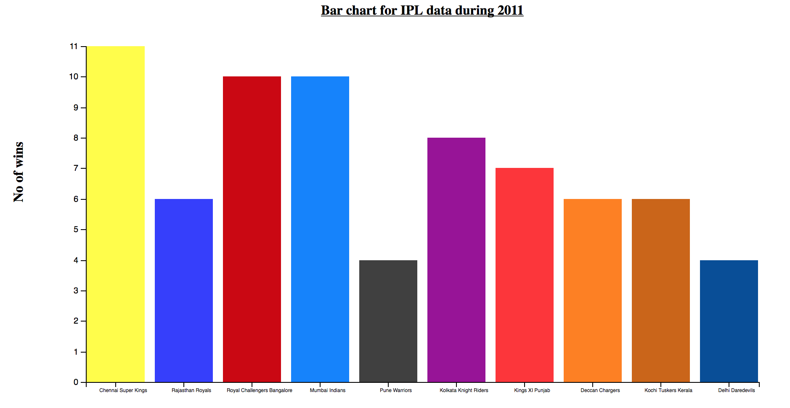
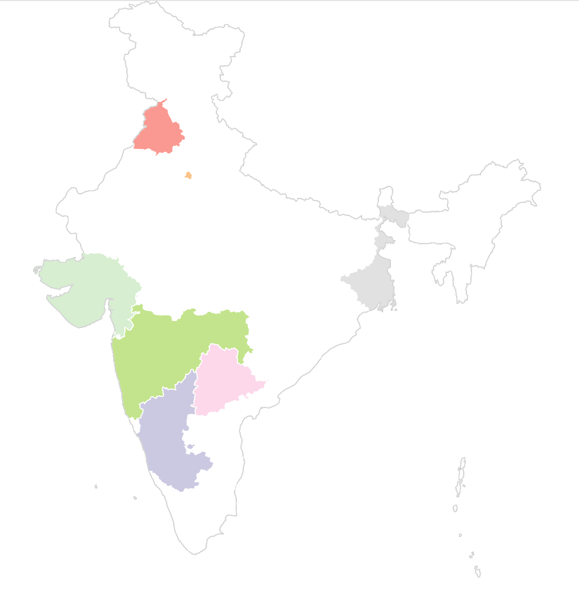

# Team : Anjani Bajaj , Bhargavi Kommineni

## [Project Proposal](https://docs.google.com/document/d/1thCe2jO5nzHneGDZ3bGYMHAQf7JScdcBN7u2UjIFCOk/edit#heading=h.qiry0ekz43dl)

## [Notes](https://docs.google.com/document/d/1lSc4E7B8FTIiY3WnjQDdcCs23JhIhWPhN9xIvkSEQvw/edit)

## Data Processing

For data processing, as mentioned in the project proposal, dataset doesn't provide the names of players in
each team during different years. As that information is required to analyze players across different teams
during different years, we have extracted that information from the existing data in json format.

### Steps involved:

1.Filter match ids of each year and store year with respective match ids from [matches.csv](https://github.com/bkommineni/DataVisualization-FinalProject/blob/master/data/matches.csv)

2.For each year based on match ids in [deliveries.csv](https://github.com/bkommineni/DataVisualization-FinalProject/blob/master/data/deliveries.csv) added players under "batsman" and "non_striker" to
batting team and players under "bowler" to bowling team

3.Verified the output of above process with the actual data available in [IPLT20](https://www.iplt20.com/) website

## Below are the sample static visualizations generated using the processed data for different years:

## Below are the sample static visualizations using geomap for 2008 and 2017:

